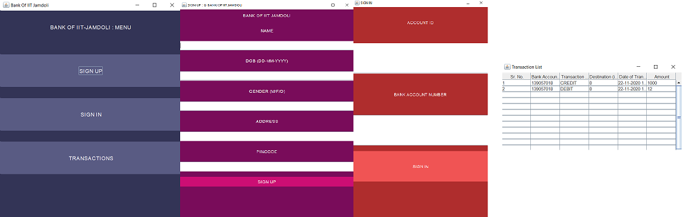

# Bank of IIT Jamdoli
Bank Management System - JAVA application
___

BOIJ is a JAVA application connected to a PostrgreSQL database with JDBC

## Install
Clone this repo and create runnable JAR

### Config 
Create a postgres database called 'bank'.
Replace proper authentication for your root postgres in **src/HelperClasses/SQLConnection.java**
Run the **CreateSchema.sql**  as 

```psql -U <username> -d bank -f <path to CreateSchema.sql>```

## Run
Run the JAR executable


#### ScreenShot


#### License
[Apache-2.0](LICENSE)